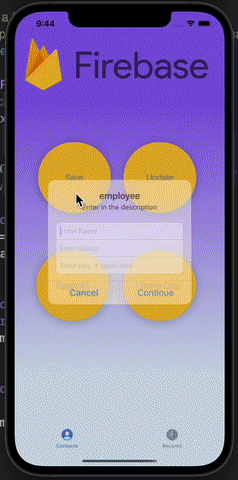
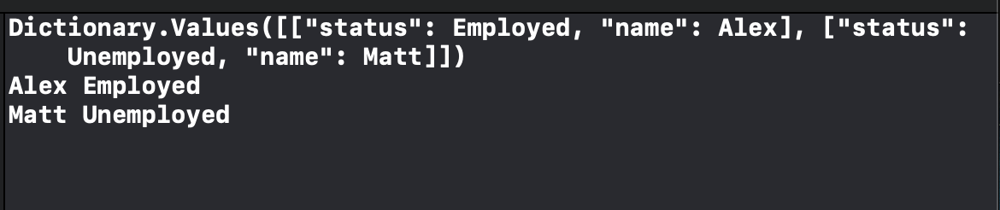

# Journal-Firebase
 A Journal hooked up with Firebase
 
 ## Summary
 A basic journal for employee tracking and creating 
 
 ## Built With
* [UIKit](https://developer.apple.com/documentation/uikit)
* [Firebase](https://console.firebase.google.com/)
 
 ## Gif of App
 
 
  ## Image of Fetching
 
 
  ## Image of Firebase
 
 
 ## Author

* **Mehdi Safari**

- [Link to Github](https://github.com/mehdisafari77)
- [Link to LinkedIn](https://www.linkedin.com/in/mehdi-safari-992799142/)
